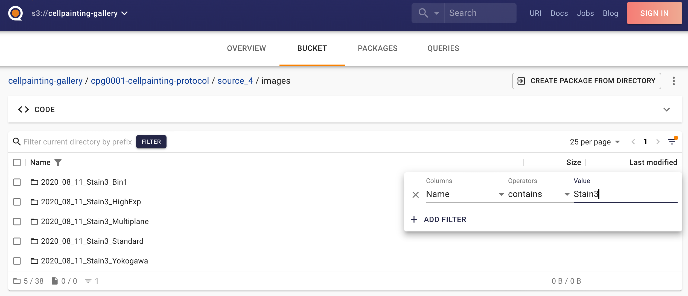
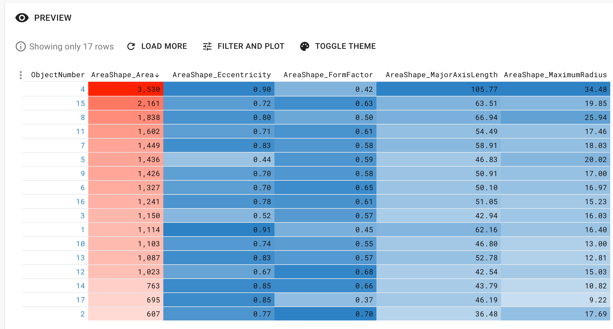
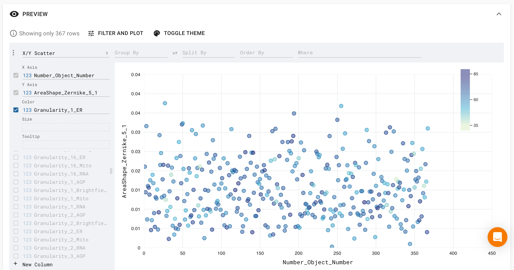

# Browsing Data on the Cell Painting Gallery

Before browsing data on the Cell Painting Gallery you may find it helpful to read about our [data structure](data_structure.md).
We provide below instructions for browsing data using Quilt, AWS CLI, or boto3.

## Browsing the Cell Painting Gallery with Quilt


The [Cell Painting Gallery is indexed on Quilt](https://open.quiltdata.com/b/cellpainting-gallery/tree/) which enables account-free, in-browser browsing of data.
Within the Cell Painting Gallery bucket you can click through prefixes for a complete listing of all files with their size and last-modified date.



Additionally, you can search/filter prefixes and files by selecting the `show filters` button (the three-line stack next to the page numbers) and entering filter/s of your choice.

For image browsing, Quilt shows thumbnails of all images in a prefix and will also show a large image preview if you select a specific image file.





For data browsing, Quilt has a number of in-browser features for browsing and exploration of tabular data (such as .csv's). Previewed tabular data can be sorted by column and columns can be color labeled, among other features. Additionally, there are built-in plotting tools for further data exploration.

## Listing the Cell Painting Gallery with AWS CLI

The Amazon Web Services Command Line Interface (AWS CLI) is a unified tool to manage AWS services from the command line.
AWS provides more information on AWS CLI [here](https://docs.aws.amazon.com/cli/latest/userguide/cli-chap-welcome.html).
Before using AWS CLI you will need to [install it](https://docs.aws.amazon.com/cli/latest/userguide/getting-started-install.html), following AWS instructions.

```bash
DATASET=cpg0000-jump-pilot
aws s3 ls s3://cellpainting-gallery/${DATASET}/ --no-sign-request
```

Though AWS S3 is object storage, listing will return the available prefixes up to the next '/', similar to returning a folder list.
You may want to perform subsequent listing, appending prefixes always with a '/' at the end of the S3 path, until you have browsed to your desired depth.
If nothing is returned after your list command then you have entered a prefix that does not exist - check for typos.

e.g.

```bash
DATASET=cpg0000-jump-pilot
aws s3 ls s3://cellpainting-gallery/${DATASET}/source_4/workspace/load_data_csv/ --no-sign-request
```

## Listing the Cell Painting Gallery with boto3

Boto3 is the Amazon Web Services (AWS) Software Development Kit (SDK) for Python.
AWS provides more information on boto3 [here](https://boto3.amazonaws.com/v1/documentation/api/latest/index.html).
Before using boto3, you will need to [install it](https://boto3.amazonaws.com/v1/documentation/api/latest/guide/quickstart.html), following AWS instructions.

```python
### Listing by "folder" ###

import boto3

# This allows access without needing AWS credentials
from botocore import UNSIGNED
from botocore.config import Config
s3 = boto3.client('s3', config=Config(signature_version=UNSIGNED))

prefix='cpg0000-jump-pilot' #e.g. 'cpg0000-jump-pilot/source_4/workspace/load_data_csv'

pages = paginator.paginate(
    Bucket='cellpainting-gallery',
    Delimiter='/',
    Prefix=f"{prefix}/")
fullprefix_list = []
for page in pages:
    for k in page['CommonPrefixes']:
        fullprefix_list.append(k['Prefix'][:-1])
folder_list = [x.replace(f'{path}/','') for x in fullprefix_list]

print (fullprefix_list)
print (folder_list)
```

Though AWS S3 is object storage, listing with `Delimiter='/'` will return the available prefixes up to the next '/', similar to returning a folder list.
Without the delimiter a list of every single object with that prefix is returned (see below for example).
You may want to perform subsequent listing, editing your prefix with increasingly nested "folders".
The `fullprefix_list` returns a list of complete prefixes within the `prefix` you passed (e.g. `['cpg0000-jump-pilot/source_4/workspace/load_data_csv/2020_11_04_CPJUMP1', 'cpg0000-jump-pilot/source_4/workspace/load_data_csv/2020_11_18_CPJUMP1_TimepointDay1', 'cpg0000-jump-pilot/source_4/workspace/load_data_csv/2020_11_19_TimepointDay4']`) while the `folder_list` returns just the "subfolders" in a list (e.g. `['2020_11_04_CPJUMP1', '2020_11_18_CPJUMP1_TimepointDay1', '2020_11_19_TimepointDay4']`)

```python
### Listing all files ###

import boto3

# This allows access without needing AWS credentials
from botocore import UNSIGNED
from botocore.config import Config
s3 = boto3.client('s3', config=Config(signature_version=UNSIGNED))
paginator = s3.get_paginator('list_objects_v2')

prefix='cpg0000-jump-pilot' #e.g. 'cpg0000-jump-pilot/source_4/workspace/load_data_csv/2020_11_04_CPJUMP1/BR00116991'

# Uses a paginator to allow listing of more than 1,000 objects
pages = paginator.paginate(Bucket='cellpainting-gallery', Prefix=path)
fullfile_list = []
for page in pages:
    for k in page['Contents']:
        fullfile_list.append(k['Key'])
file_list = [x.replace(f'{path}/','') for x in fullfile_list]

print (file_list)
```

This will list all files with a prefix no matter the subsequent "nesting".
The `fullfile_list` returns a list of complete files (i.e. all objects) within the `prefix` you passed (e.g. `['cpg0000-jump-pilot/source_4/workspace/load_data_csv/2020_11_04_CPJUMP1/BR00116991/load_data.csv', 'cpg0000-jump-pilot/source_4/workspace/load_data_csv/2020_11_04_CPJUMP1/BR00116991/load_data_with_illum.csv']`) while the `file_list` returns just the file names in a list (e.g. `['load_data.csv', 'load_data_with_illum.csv']`).
